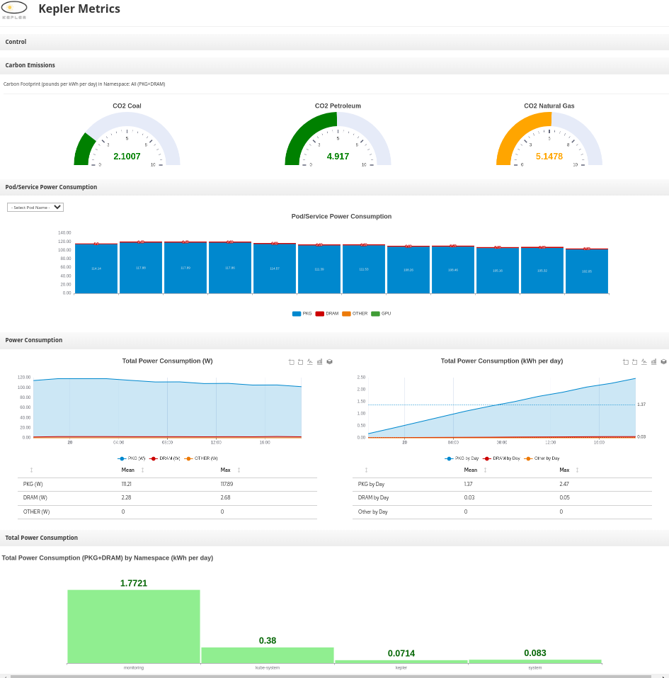

Dashbuilder Dashboards for Monitoring Kepler
--

Dashbuilder is a client-side tool for building dashboards using YAML. In this directory you will find a Kepler dashboard built with Dashbuilder:

* **kepler.dash.yaml**: A dashboard for using with Kepler and Prometheus. Edit the property `prom_url` to point to your Prometheus installation;

### Editing the dashboard

The YAML can be edited on Dashbuilder online editor. Import this project on the online editor or use direct link to edit:

*[Edit kepler.dash.yaml](https://start.kubesmarts.org/#/import?url=https://github.com/sustainable-computing-io/kepler-dashboard/blob/main/dashbuilder/kepler.dash.yaml)*

It is also possible to use [Dashbuilder VSCode Extension](https://marketplace.visualstudio.com/items?itemName=redhat.vscode-extension-dashbuilder-editor).

### Deploying

You can deploy these dashboards on a separated web application or embed in your own web application as described in [Dashbuilder Deployment Guide](https://www.dashbuilder.org/docs/#chap-dashbuilder-deployment)